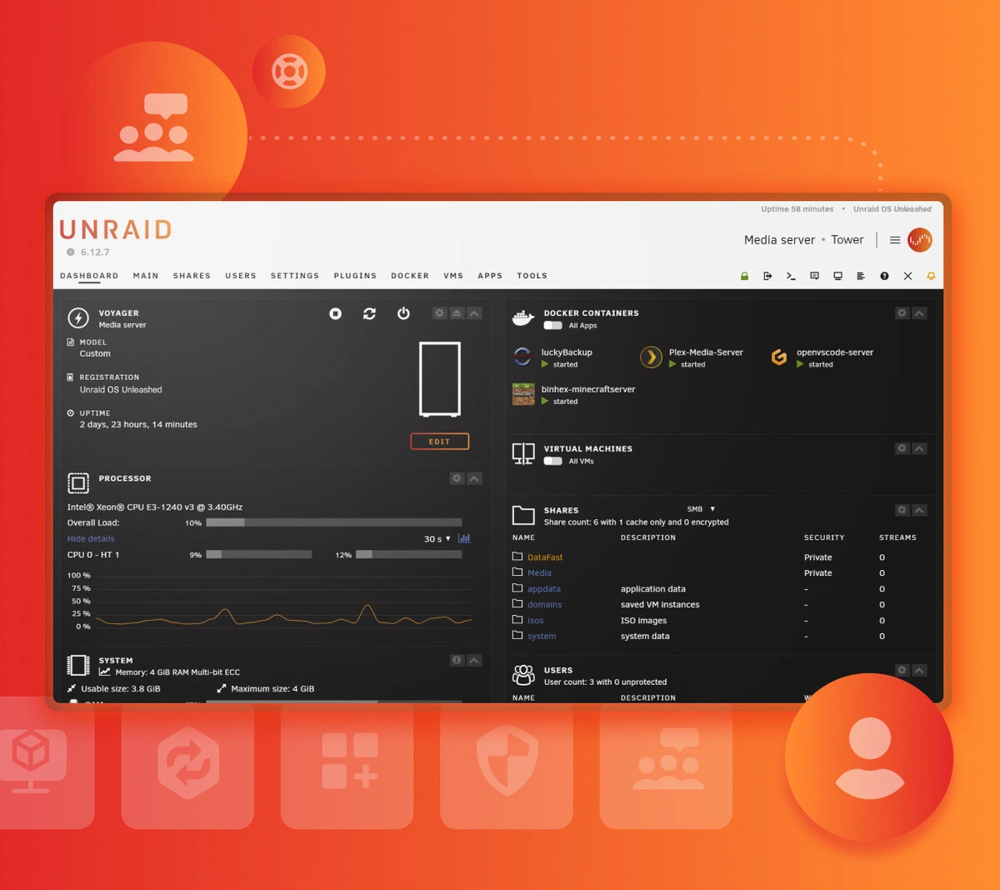

> # **UNRAID: What will you build?**
>
>Unraid is a powerful, easy-to-use operating system for self-hosted servers and network-attached storage. Make the most out of your hardware—no matter what kind of drive you have on hand.
> 
> — <cite>source: [unraid.net](https://unraid.net/)

### **Primary Features and uses**

- NAS Operating System - Simply your setup
- Docker Applications - Access to Community built applications.
- Virtual Machines - Enable full featured Virtual machines

