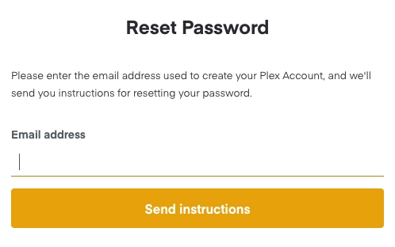

# Help, I forgot my Plex password!

!!! quote
    If you’ve forgotten your password and need to have it reset, you can find a Forgot? link on email sign-in form.

    { width="498" }
    /// caption
    Forgot password?
    ///

    Enter your email address and submit the form. If the address matches an existing, active Plex account, an email will be sent that contains instructions on resetting the account password.

    !!! note
        If there is no Plex account matching the submitted address or if you have deleted your Plex account, then no email will be sent.

    **Related Page**: [Plex: Forgot Password?](https://app.plex.tv/auth#?resetPassword)
