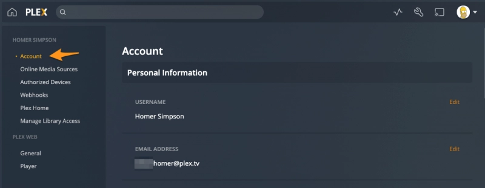

# Missing Confirmation Emails

## Expected Notifications
When you request content, you should receive two automated emails:

1. Request approval confirmation
2. Content availability notification when ready to stream

## Troubleshooting Missing Emails
If you're not receiving these notifications, it's likely because:

- You may have signed up for Plex using an old or inactive email address
- Your email settings in Plex need to be updated

## How to Update Your Email
To fix this, you'll need to update the email address associated with your Plex account.

!!! quote
    Once signed in to your Plex account, you can manage your account information at any time from Plex Web App. Click the top right user menu and then choose Account. Here, you’ll be able to edit and manage various aspects of your Plex account.

    { width="800" }
    /// caption
    Plex account email
    ///

    **Related Page**: [Plex Web App: Account Page](https://app.plex.tv/desktop#!/settings/account)

!!! note
    After updating your email, new request notifications will be sent to your updated address.
