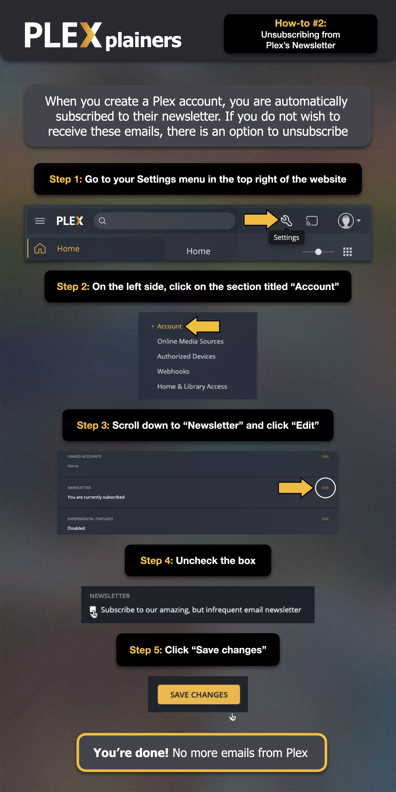

# Managing Newsletter Subscriptions

## Plex's Official Newsletter
New Plex accounts are automatically subscribed to Plex's company newsletter. This is managed by Plex directly and is not controlled by my server. You can unsubscribe from this through your Plex account settings.

!!! example "How-to: Unsubscribing from Plex's Newsletter"

    

    **Source**: [plxplainers.xyz](https://www.plxplainers.xyz/)

## My Weekly Newsletter
I send out a separate, personal newsletter every Friday at 5:00 PM. You can identify it by:

- Email address sending this newsletter will be `{{ vars.noreply_email }}`
- The newsletter itself will have a logo with the name of my Plex server

If you'd like to unsubscribe from my newsletter, please contact me privately.

!!! example ""

    
